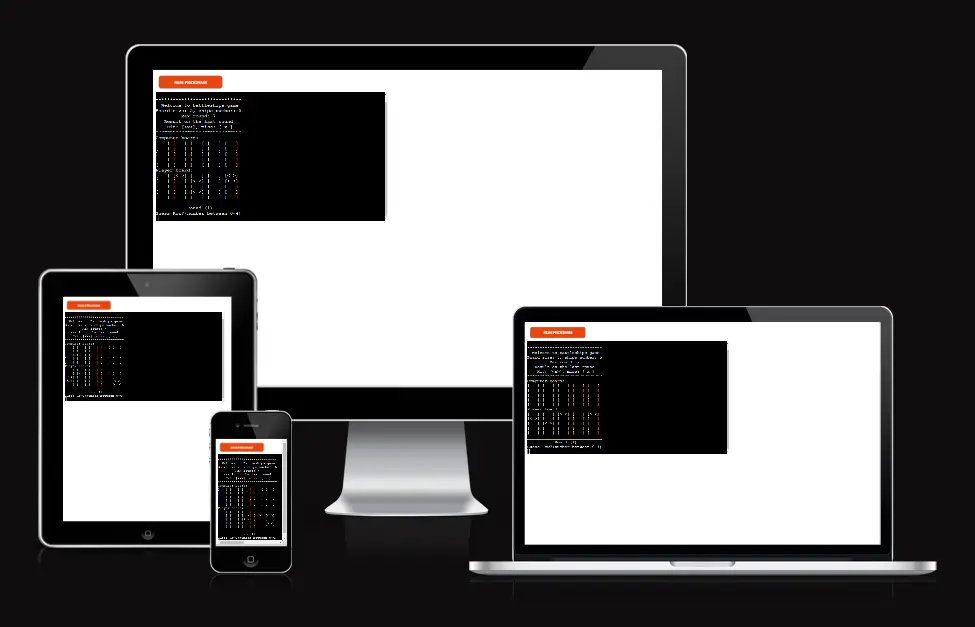
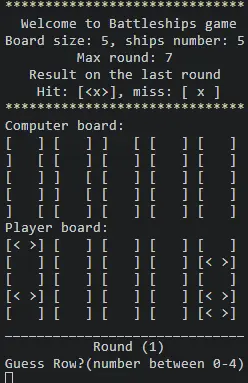
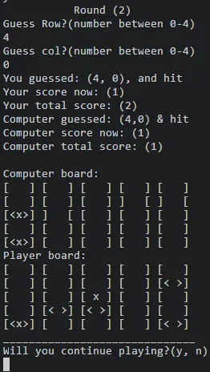
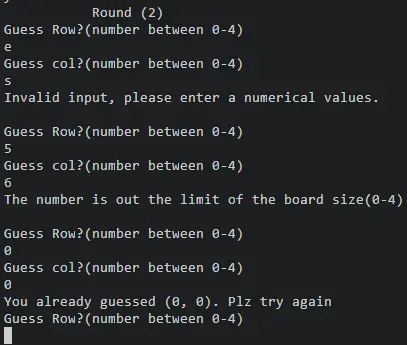
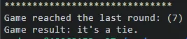

# Battleships

Battleships is a python terminal game, which runs in the Code Institute mock terminal on Heroku.

The user will play against the computer, and each have their ships that sailing in their boards.
The user tries to hit the computer ships before the computer is willing to do the same against the user.

Please click here to visit the project.

## How to play 

Short instructions appear at the top of the game when start playing.

- symbols used in boards: 

  - < >  : User ship
  -  x   : missed a ship
  - < x > : Hit a ship
  

Ships will add randomly to each player, but the user can’t see the computer ships.

Computer will guess the location of user ships randomly and play again if guess the same.

- Validate data: 

  - The number is out the limit of the board size (0-4).
  - Invalid input, please enter a numerical value.
  - You already guessed this. Try again.

User will guess the location of computer ships using input with validate data.

- Game rounds: 

  - During each round: the user and computer will play, and their boards are displayed to indicate if each player hit or missed their target. Followed by the round scores and the total scores.

  - In the end of each round: an input request if the user wants to continue playing:

The game will loop in 7 rounds and after the max round the result is declared on who is the winner.

The max round can be adjusted in the code.

## Testing

### Validator Testing

- pep8 linter

  - Passed with no errors find.

### Unfixed Bugs

- See the Validator Testing paragraph above for JavaScript by JSHint.

### Fixed Bugs

- Add another loop for continue the game inside the main loop of the game rouns, to fix the stop game bug.

- Unfortunately,I couldn’t add imported logo to the project as it may collapse when deploying the project on Heroku.

## Deployment
This project was deployed using Code Inistitute's mock terminal for Heroku.

- Deployment steps: 

  - Fork or clone this repository
  - Create a new Heroku app.
  - Set the buildbacks to Python and NodeJs.
  - Link the heroku app to repository.
  - Click on deploy.